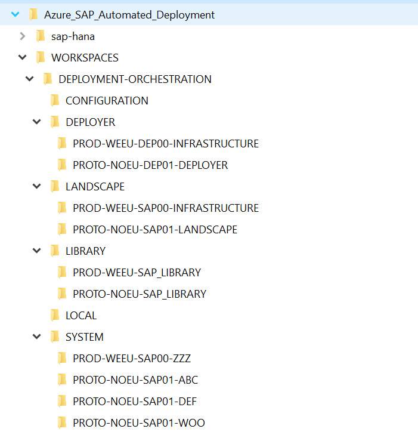

# Customer's repo design

To facilitate a DevOps approach for the automation process it is recommended that the configuration and parameter files are kept in a source control repository that the customer manages.

The development environment should clone both the “sap-hana” repository and the customer repository into the same root folder, creating a folder structure like the one shown below:

The root folder “WORKSPACES” contains the following folders.

|Folder Name|Contains|Notes|
| :- | :- | :- |
|DEPLOYMENT-ORCHESTRATION|Configuration and template files|This is the root folder for all the systems that are managed from the deployment environment|
|CONFIGURATION|Configuration files, for example custom disk sizing|Storing the custom configuration files in a shared folder simplifies referring to them|
|DEPLOYER|Contains the configuration files for all Deployer deployments managed by the deployment environment|Each subfolder should be named according to the naming standard “Environment-region-Virtual Network”. The structure of the json parameter files are defined here [Deployer configuration](../Software_Documentation/configuration-deployer.md#Parameter-file-construction)|
|LIBRARY|Contains the configuration files for all Library deployments managed by the deployment environment|Each subfolder should be named according to the naming standard “Environment-region”. The structure of the json parameter files are defined here [Library configuration](../Software_Documentation/configuration-sap_library.md#Parameter-file-construction)|
|LANDSCAPE|Contains the configuration files for all Landscape deployments managed by the deployment environment|Each subfolder should be named according to the naming standard “Environment-region-Virtual Network”. The structure of the json parameter files are defined here [Workload Zone configuration](../Software_Documentation/configuration-sap_landscape.md#Parameter-file-construction)|
|SYSTEM |Contains the configuration files for all System (SID) deployments managed by the deployment environment|Each subfolder should be named according to the naming standard “Environment-region-Virtual Network-SID”. The structure of the json parameter files are defined here [System configuration](../Software_Documentation/configuration-sap_deployment_unit.md#Parameter-file-construction)|
