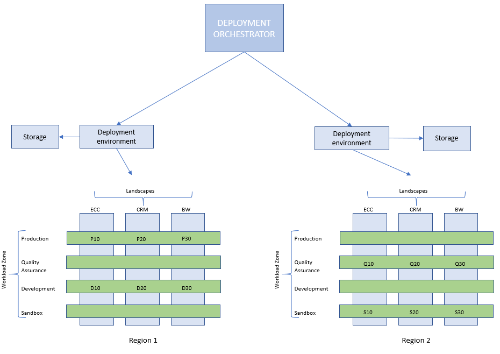
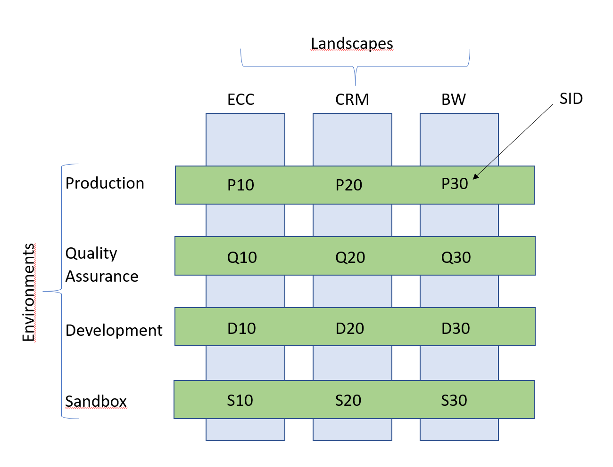

# **SAP Deployment Automation Framework** #

# Getting started with the SAP Deployment Automation framework #

The SAP Deployment Automation Framework provides both Terraform templates and Ansible playbooks which can be used to build and configure the environments to run SAP on Azure.

## Table of Contents <!-- omit in toc --> ##

- [Planning](##Planning-environment)
  - [SPN](##SPN-Creation)
  - [DevOps planning](##DevOps-planning)
  - [Deployment scenarios](##Deployment-Scenarios)
  - [Region planning](##Region-planning)
    - [Deployment Environment](##Deployment-environment)
    - [SAP Library](##SAP-Library)
  - [Workload planning](##Workload-zone-planning)
  - [SAP System planning](##SAP-System-planning)
- [Deployment Flow](##Deployment-flow)
- [Sample Files](##Sample-files)

## Planning ##

This section covers the high level steps for the planning process and the decisions that need to be made.

The Terraform deployment will use the Microsoft provided Terraform templates from this repository and the customer provided parameter files that contain the system specific information. During the deployment information from both will be merged..

### **Credentials management** ###

The SAP Deployment Automation leverages Service Principals to perform the deployment activities. The Automation Framework has the ability to use different deployment credentials for each workload zone. These credentials are persisted in the deployer Key Vault and are dynamically retrieved during the deployment.

The other type of credentials used by the automation are the default Virtual Machine accounts - these are the accounts provided during the virtual machine creation time. The table below lists the different credential types used by the SAP Deployment Automation.

Credential                   |  Scope       | Storage            | Identifier                    | Description                    |
| :--------------------------|  :---------- | :----------------- | :---------------------------- | :----------------------------- |
| Local user                 | Deployer     |                    | Current User                  | Used to bootstrap the deployer |
| Service Principal          | Environment  | Deployer Key Vault | Environment identifier        |
| Virtual Machine credential | Environment  | Workload Key Vault | Environment identifier        | Default Virtual Machine user   |  

<br>

### **SPN Creation** ###

The Service Principals can be created using the following steps.

1. Create SPN

From a privilaged account, create an Service Principal using the following commands. Please use a descriptive name that includes the environment name.

   ```bash
   az ad sp create-for-rbac --role="Contributor" --scopes="/subscriptions/xxxxxxxx-xxxx-xxxx-xxxx-xxxxxxxxxxxx" --name="DEV-Deployment-Account"
   ```

2. Record the credential outputs.

   The pertinant fields are:
   - appId
   - password
   - tenant

```json
    {
      "appId": "xxxxxxxx-xxxx-xxxx-xxxx-xxxxxxxxxxxx",
      "displayName": "DEV-Deployment-Account",
      "name": "http://DEV-Deployment-Account",
      "password": "xxxxxxxxxxxxxxxxxxxxxxxxxxxxxxxxxx",
      "tenant": "xxxxxxxx-xxxx-xxxx-xxxx-xxxxxxxxxxxx""
    }
 ```

3. Add User Access Administrator Role Assignment to the Service Principal.

   ```bash
   az role assignment create --assignee <appId> --role "User Access Administrator"
   ```

## **DevOps planning** ##

The Terraform automation templates are hosted in the this repository. In most cases customers should treat this repository as read only.

The deployment automation leverages json parameter files to configure the deployments to Azure. It is highly recommended that these parameter files would be stored in the customers source control environment.  

For more details on how to optimally structure the folder hierarchy for the deployment parameter files see [Folder hierarchy](./Deployment_folder_structure.md). Having the parameter files in a predefined folder structure will simplify automated deployment operations.

**Note!** The json parameter name will become the terraform state file name so the file names need to be unique.

The default deployment model of the SAP Deployment Automation Framework will deploy an Azure Virtual Machine that can be used to execute the deployment activities, future versions of the framework will provide means to use other execution environment as well (Azure DevOps)


## **Deployment Scenarios** ##

The SAP Deployment Automation Framework supports deployment into greenfield scenarios (no Azure infrastructure componenents exist) or brownfield scenarios (Azure infrastructure components exist (network etc))

### Greenfield deployment ###

In the Greenfield scenario no Azure infrastructure components for the SAP on Azure deployment exists. The Automation framework will create the virtual network, the subnets, the keyvaults which are required for the system deployments.

### Brownfield deployment ###

In the Brownfield scenarion the Automation framework will deploy the systems using existing Azure resources like the virtual network.

For more information see [Deployment scenarios(./deployment_scenarios.md)]

## **Region planning** ##

The SAP Deployment Automation supports deployments in multiple Azure Regions. Each region will host:

- Deployment infrastructure
- SAP Library for state and SAP installation media
- 1-n Workload zones
- 1-n SAP systems deployed in the Workload Zones.  



## **Deployment environment** ##

If the deployment infrastructure and the SAP Library will support multiple workload zones in the region it is recommended that the deployment environment and the SAP Library would use an environment identifier that is different from the workload zones, for example "MGMT".

The automation also supports having the deployment environment and the SAP Library in a separate subscriptions from the workload zones.

### Design questions - regions ###

- Which Azure regions are in scope?

### **Deployment environment services** ###

The deployment environment provides the following services

1. Deployment Virtual Machine, this virtual machine can be used to perform both the Terraform deployments as well as the Ansible configurations.
2. Azure Keyvault, this keyvault will containg the Service Principal details and will be used by the Terraform deployments
3. Azure Firewall, this optional component is used to provide outbound Internet connectivity.

### Configuring the deployment environment ###

The deployment configuration file defines the region and the environment name and the Virtual Network information for the Deployment Virtual Machine.

   ```json
   {
      "infrastructure": {
         "region"                      : "westeurope",
         "environment"                 : "MGMT",
         "vnets": {
               "management": {
                  "address_space"      : "10.10.20.0/25",
                  "subnet_mgmt": {
                     "prefix"          : "10.10.20.64/28"
                  }
               }
         }
      }
   }
   ```

A sample deployment environment configuration is specified in [Deployment Environment](WORKSPACES/DEPLOYMENT-ORCHESTRATION/DEPLOYER/MGMT-WEEU-DEP00-INFRASTRUCTURE/MGMT-WEEU-DEP00-INFRASTRUCTURE.json)

For more details on the deployer see [Deployer](../Software_Documentation/product_documentation-deployer.md)

For more details on the configuration of the deployer see [Deployment Configuration](../Software_Documentation/configuration-deployer.md)

## **SAP Library** ##

The SAP Library provides the following services:

- Storage for the Terraform state files
- Storage for the SAP Installation media

### Configuring the SAP Library ###

The SAP Library configuration file defines the region and the environment name .

```json
   {
      "infrastructure": {
         "region"                   : "westeurope",
         "environment"              : "MGMT",
         "resource_group": {
            "name"                  : "WEEU-MGMT-SAP_LIBRARY"
         }
      },
      "deployer": {
         "environment"              : "MGMT",
         "region"                   : "westeurope",
         "vnet"                     : "MGMT00"
      }
   }
```

A sample deployment for the SAP library configuration is specified in [Library Environment](WORKSPACES/DEPLOYMENT-ORCHESTRATION/LIBRARY/MGMT-WEEU-SAP_LIBRARY/MGMT-WEEU-SAP_LIBRARY.json)

For more details on the SAP Library see [SAP Library](../Software_Documentation/product_documentation-sap_library.md)
For more details on the configuration of the SAP Library see [SAP Library Configuration](../Software_Documentation/configuration-sap_library.md)

## **Workload zone planning** ##

An SAP Application has typically multiple tiers, for instance development quality assurance and production. The SAP Deployment Automation refers to these tiers as workload zones.

A workload zone combines the workload Virtual Network and the set of credentials to be used in the systems in that workload as well as the Service Principal that is used for deploying systems. The Workload Zones are regional as they depend on the Azure Virtual Network. The naming convention of the automation supports having workload zones in multiple Azure regions each with their own virtual network.

Some common patterns for workload zones are:

### **Production and Non-Production** ###

In this model the SAP environments are partitioned into two workload zones, production and non production.

### **Development, Quality Assurance, Production** ###

In this model the SAP environments are partitioned into three workload zones, development, quality assurance and production.



### Design questions - workload zone ###

How many workload zones are required?
Which regions are the workloads deployed to?
Is the deployment a Greenfield deployment (no Azure Infrastructure for the Workload exists) or a Brownfield deployment (some or all of the artifacts supporting the workload zone already exists)?

### **Workload Zone** ###

The Workload Zone provides the following services:

- Azure Virtual Network (including subnets and network security groups)
- Azure Keyvault for system credentials
- Storage account for bootdiagnostics
- Storage account for cloud witness

### Configuring the Workload Zone ###

The Workload Zone configuration file defines the region and the environment name as well as the Virtual Network information (existing or new). The configuration also allows for specifying the default credentials (username and password or ssh keys) that will be used by the SAP Systems deployments-

```json
    {
        "authentication": {
            "username"                      : "azureadm"
        },
        "infrastructure": {
            "environment"                   : "DEV",
            "region"                        : "westeurope",
            "vnets": {
                "sap": {
                    "name"                  : "SAP01",
                    "address_space"         : "10.110.0.0/24",
                    "subnet_admin": {
                    "prefix"              : "10.110.0.0/27"
                    },
                    "subnet_app": {
                    "prefix"              : "10.110.0.32/27"
                    },
                    "subnet_db": {
                    "prefix"              : "10.110.0.64/27"
                    },
                    "subnet_web": {
                    "prefix"              : "10.110.0.96/27"
                    }
                }
            }
        }
    }
```

A sample workload zone configuration is specified in [Workload Zone Environment](WORKSPACES/DEPLOYMENT-ORCHESTRATION/LANDSCAPE/DEV-WEEU-SAP00-INFRASTRUCTURE/DEV-WEEU-SAP01-INFRASTRUCTURE.json)

The deployment will create a Virtual network and a storage account for boot diagnostics and a storage account which can be used as the witness disk for Windows High Availability Architectures and two key vaults. The deployment will populate the keyvault with the default credentials for the Virtual Machines.

For more details on the Workload Zone see [Workload Zone](../Software_Documentation/product_documentation-sap-workloadzone.md)
For more details on the configuration of the SAP Library see [Workload Zone Configuration](../Software_Documentation/configuration-sap_workloadzone.md)

<br>

## **SAP System planning** ##

The SAP System is the actual SAP Application, it contains all the Azure artifacts required to host the SAP Application.

A sample SAP System configuration is specified in [SAP System](WORKSPACES/DEPLOYMENT-ORCHESTRATION/SYSTEM/DEV-WEEU-SAP00-X00/DEV-WEEU-SAP01-X00.json)

The deployment will create a SAP system that has an Hana database server, 2 application servers, 1 central services server and a web dispatcher and two key vaults (which can be ignored for now).

### Design questions - SAP System ###

- Which database backend to use?
- The number of database servers?
- Is high availability required?
- The number of Application Servers?
- The number of Web Dispatchers (if any)?
- The number of Central Services instances?
- The sizes of the virtual machines?
- Which image to use marketplace/custom?
- Is the deployment a Greenfield deployment (no Azure Infrastructure for the subnets created) or a Brownfield deployment (some or all of the artifacts for the subnets already exists)?
- IP Allocation strategy (Azure or customer provided)

<br>

## **Deployment flow** ##

The deployment flow has three steps: Preparing the region, preparing the environment(s) and deploying the systems.

### Prepare the region ###

This step deploys the required artifacts to support the SAP Automation framework in a specifed Azure region.
This includes creating the deployment environment and the shared storage for Terraform statefiles as well as the SAP installation media.

### Preparing the workload zone ###

This step deploys the Workload Zone specific aritfacts: the Virtual Network and the Azure Key Vaults used for credentials management.

### Deploying the system ###

This step deploys the actual infrastructure for the SAP System (SID)

## Sample files ##

The repository contains a folder [WORKSPACES](WORKSPACES) that has a set of sample parameter files that can be used to deploy the supporting components and the SAP System. The folder structure is documented here: [Deployment folder structure](Deployment_folder_structure.md)

The name of the environment is **DEV** and it is deployed to West Europe. The SID of the application is X00.

The sample deployment will create a deployment environment, the shared library for state management, the workload virtual network and a SAP system.

## Choosing the orchestration environment ##

The templates and scripts need to be executed from an execution environment, currently the supported environments are:

- Azure Cloud Shell
- Azure hosted Virtual Machine
- Local PC

The links below explain how to deploy using the different deployment environments.

[Deploying from cloud shell](./Getting_started_with_the_SAP_Deployment_Automation_cloudshell.md)

[Deploying from the Linux](./Getting_started_with_the_SAP_Deployment_Automation_bash.md)

[Deploying using PowerShell](./Getting_started_with_the_SAP_Deployment_Automation_pwsh.md)


## Changing the naming convention ##

The automation uses a default naming convention which is defined in the Standard naming convention document [standards-naming.md](.//Software_Documentation/standards-naming.md)

[naming conventions for the deployment](https://github.com/Azure/sap-hana/blob/documentation-updates/documentation/SAP_Automation_on_Azure/Process_Documentation/Changing_the_naming_convention.md) should be defined upfront and can be customized according the needs.

## Changing disk sizing ##

 [Using_custom_disk_sizing.md](./Using_custom_disk_sizing.md)