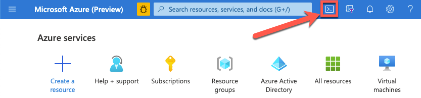
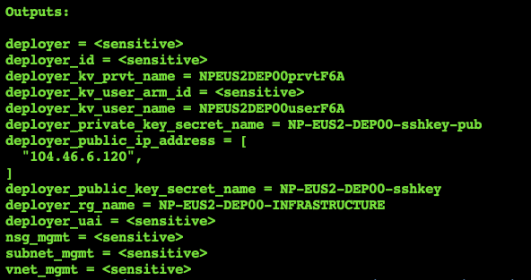
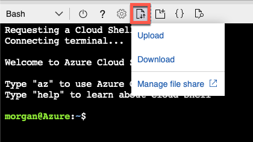

###  SAP Deployment Automation Framework <!-- omit in toc -->
<br/><br/>

# Bootstrapping the Deployer <!-- omit in toc -->

<br/>

## Table of contents <!-- omit in toc -->

- [Overview](#overview)
- [Procedure](#procedure)

<br/>

## Overview


|                  |              |
| ---------------- | ------------ |
| Duration of Task | `12 minutes` |
| Steps            | `10`         |
| Runtime          | `5 minutes`  |

---

<br/><br/>

## Procedure

<br/>

1. Cloud Shell
   1. Log on to the [Azure Portal](https://portal.azure.com).
   2. Open the cloud shell.
      <br/>

<br/>

2. Ensure that you are authenticated with the correct subscription.
    ```bash
    az login
    az account list --output=table | grep -i true
    ```

    If not, then find and set the Default to the correct subscription.

    ```bash
    az account list --output=table
    az account set  --subscription XXXXXXXX-XXXX-XXXX-XXXX-XXXXXXXXXXXX
    ```

<br/>

3. Install the correct version of Terraform.
    ```bash
    mkdir ~/bin; cd $_
    alias terraform=~/bin/terraform
    wget https://releases.hashicorp.com/terraform/0.12.29/terraform_0.12.29_linux_amd64.zip
    unzip terraform_0.12.29_linux_amd64.zip
    ```

<br/>

4. Repository
   1. Clone the Repository and Checkout the branch.
        ```bash
        mkdir -p ~/Azure_SAP_Automated_Deployment; cd $_
        git clone https://github.com/Azure/sap-hana.git
        cd  ~/Azure_SAP_Automated_Deployment/sap-hana
        ```

    2. Checkout Branch
        ```bash
        git checkout feature/keyvault
        ```

    3. Verify Branch is at expected Revision: `173b8b522e4e5b932a614cf13a20a07e859e4329`
        ```bash
        git rev-parse HEAD
        ```

<br/>

5. Create Working Directory.
    ```bash
    mkdir -p ~/Azure_SAP_Automated_Deployment/WORKSPACES/LOCAL/NP-EUS2-DEP00-INFRASTRUCTURE; cd $_
    ```

<br/>

6. Create input parameter [JSON](templates/NP-EUS2-DEP00-INFRASTRUCTURE.json)
    ```bash
    vi NP-EUS2-DEP00-INFRASTRUCTURE.json
    ```

<br/>

7. Terraform
    1. Initialization
       ```bash
       terraform init  ../../../sap-hana/deploy/terraform/bootstrap/sap_deployer/
       ```

    2. Plan
       ```bash
       terraform plan  --var-file=NP-EUS2-DEP00-INFRASTRUCTURE.json                    \
                       ../../../sap-hana/deploy/terraform/bootstrap/sap_deployer/
       ```

    3. Apply
       <br/>
       *This step deploys the resources*
       ```bash
       terraform apply --auto-approve                                                  \
                       --var-file=NP-EUS2-DEP00-INFRASTRUCTURE.json                    \
                       ../../../sap-hana/deploy/terraform/bootstrap/sap_deployer/
       ```

<br/>

8. Post Processing
    1. In Output Section make note of the following 
       1. deployer_public_ip_address
       2. deployer_kv_user_name
       3. deployer_kv_prvt_name
       4. deployer_public_key_secret_name
       5. deployer_private_key_secret_name
      
        <br/>
        <br/><br/>

    2. Post Processing.
       ```bash
       ./post_deployment.sh
       ```
       <br/>

    3. Extract SSH Keys
       1. Private Key
          ```
          az keyvault secret show            \
            --vault-name NPEUS2DEP00userF6A \
            --name NP-EUS2-DEP00-sshkey   | \
            jq -r .value > sshkey
          ```
       <br/>

       1. Public Key
          ```
          az keyvault secret show               \
            --vault-name NPEUS2DEP00userF6A     \
            --name NP-EUS2-DEP00-sshkey-pub   | \
            jq -r .value > sshkey.pub
          ```
       <br/><br/>

    4. Download the Private/Public Key Pair for use in your SSH Terminal Application
       <br/>
       <br/><br/><br/><br/>


# Next: [Bootstrap - SPN](02-spn.md) <!-- omit in toc -->
