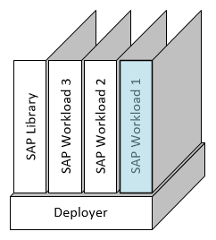

###  SAP Deployment Automation Framework <!-- omit in toc -->
<br/><br/>

# Logical SAP Workload VNET <!-- omit in toc -->

<br/>

## Table of contents <!-- omit in toc -->

- [Overview](#overview)
- [Procedure](#procedure)
  - [Logical SAP Workload VNET](#logical-sap-workload-vnet)

<br/>

## Overview


|                  |              |
| ---------------- | ------------ |
| Duration of Task | `5 minutes`  |
| Steps            | `6`          |
| Runtime          | `1 minutes`  |

---

<br/><br/>

## Procedure

### Logical SAP Workload VNET

<br/>

1. Create Working Directory.
    ```bash
    mkdir -p ~/Azure_SAP_Automated_Deployment/WORKSPACES/SAP_LANDSCAPE/NP-EUS2-SAP0-INFRASTRUCTURE; cd $_
    ```

<br/>

2. Create *backend* parameter file.
    ```bash
    cat <<EOF > backend
    resource_group_name   = "NP-EUS2-SAP_LIBRARY"
    storage_account_name  = "<tfstate_storage_account_name>"
    container_name        = "tfstate"
    key                   = "NP-EUS2-SAP0-INFRASTRUCTURE.terraform.tfstate"
    EOF
    ```

<br/>

3. Create input parameter [JSON](templates/NP-EUS2-SAP0-INFRASTRUCTURE.json)
    ```bash
    vi NP-EUS2-SAP0-INFRASTRUCTURE.json
    ```

<br/>

4. Terraform
    1. Initialization
       ```bash
       terraform init  --backend-config backend                                        \
                       ../../../sap-hana/deploy/terraform/run/sap_system/
       ```

    2. Plan
       ```bash
       terraform plan  --var-file=NP-EUS2-SAP0-INFRASTRUCTURE.json                     \
                       ../../../sap-hana/deploy/terraform/run/sap_system/
       ```

    3. Apply
       <br/>
       ```bash
       terraform apply --auto-approve                                                  \
                       --var-file=NP-EUS2-SAP0-INFRASTRUCTURE.json                     \
                       ../../../sap-hana/deploy/terraform/run/sap_system/
       ```

<br/>


<br/><br/><br/><br/>

# Next: [SAP Deployment Unit - SDU](06-sdu.md) <!-- omit in toc -->
