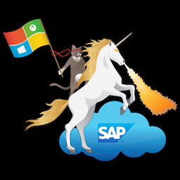

###  SAP Deployment Automation Framework <!-- omit in toc -->
# Overview <!-- omit in toc -->

<!-- TODO: Refine this document -->

The **SAP on Azure Deployment Automation Framework** is a collection of processes and a flexible workflow.

There are two distinct phases.
- The IaaS deployment
- The Configuration deployment

First lets talk about the IaaS deployment.

Parameter driven IAC which deploy the infrastructure components (such as VMs, network, storage) in Azure.

At a high level this workflow begins with establishing a deployment environment from which all activities occur.

TODO: Image

Then we create the enviroment to support the workload.

TODO: Image

And finally we deploy the SAP platform

TODO: Image

Workflow
establish deployer
establish SAP Library
establish SAP Workload VNET
Deploy SAP Platform

Second is configuration deployment

Here we use Ansible to configure each deployed server to build up to a configuration.
Parameter driven CAC which run different roles to configure and VMs and install SAP HANA and required applications on the already deployed infrastructure.

- OS configuration, base
- OS configuration, SAP specific
- SAP BOM Processing
- SAP Installation
- DB, HANA
- ERS configuration
- Pacemaker Configuration

    

# Back: [Table of Contents](table_of_contents.md) <!-- omit in toc -->
