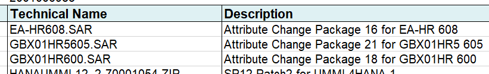

# Application BoM Preparation

## :hand: Note

The manual process documented here is sufficient to produce a functional BoM. However, it does not include steps for including SAP "permalinks" to media.

The process for generating a BoM which includes SAP "permalinks" is more complex and has additional acquisition steps which must be done during [Acquisition of Media](acquire-media.md) and before the SAP Download Manager is run. The process is described in the [Application Full BoM Preparation](prepare-full-app-bom.md) document.

The manual process to generate a "basic" BoM is very time consuming - perhaps around a day's work. However, the "full" BoM is likely to take twice as long because of the increased complexity and risk of error.

A `bash` script is available in the `util` folder which may be used to generate a "full" BoM in less than a second, with a few, minor caveats. The use of this script is documented within the [Application Full BoM Preparation](./prepare-full-app-bom.md) document.

## Prerequisites

1. Microsoft Excel for viewing the Excel stack file spreadsheet.
1. An editor for creating the SAP Application BoM file.
1. Application installation template(s) for SCS and/or PAS/AAS uploaded to the Storage Account.
1. SAP Application media present on the Storage Account.
1. An empty folder in which to create the BoM file.

## Inputs

1. Stack files.

## Process

1. Download the associated stack files to your workstation's empty, working folder;
1. Create an empty text file called `bom.yml`.

   ```text
   .
   ├── bom.yml      <-- BoM content will go in here
   ├── MP_Excel_xxx.xls
   ├── MP_Plan_xxx.pdf
   ├── MP_Stack_xxx.txt
   ├── MP_Stack_xxx.xml
   └── myDownloadBasketFiles.txt
   ```

### Example Partial BoM File

An example of a small part of a BoM file for S/4HANA 1909 SP2 is shown, below. The `[x]` numbered sections are covered in the following documentation. Note that `v001` is a sequential number used to indicate the internal (non-SAP) version of the files included.

Note that the `name` property is optional in `media`, `stackfiles` and `templates`. If provided, it will be used by the BoM validator to note entries having errors.

Complete, usable BoM files are available in the [examples](../examples/) directory.

```text
step|BoM Content
    |
    |---
    |
[1] |name:    'S4HANA_2020_ISS_v001'
[2] |target:  'ABAP PLATFORM 1909'
    |
[3] |defaults:
    |  target_location: "{{ target_media_location }}/download_basket"
    |
[4] |product_ids:
    |  scs:
    |  db:
    |  pas:
    |  aas:
    |  web:
    |
[5] |materials:
[6] |  dependencies:
    |    - name:     HANA2_00_052_v001
    |
[7] |  media:
    |    - name:     SAPCAR
    |      archive:  SAPCAR_1320-80000935.EXE
    |
    |    - name:     SWPM
    |      archive:  SWPM20SP06_6-80003424.SAR
    |
    |    - name:     SAP IGS HELPER
    |      archive:  igshelper_17-10010245.sar
    |
    |    - name:     SAP HR 6.08
    |      archive:  SAP_HR608.SAR
    |
    |    - name:     S4COREOP 104
    |      archive:  S4COREOP104.SAR
    |
[8] |  templates:
    |    - name:     "S4HANA_2020_ISS_v001 ini file"
    |      file:     "S4HANA_2020_ISS_v001.inifile.params"
    |      override_target_location: "{{ target_media_location }}/config"
    |
[9] |  stackfiles:
    |
    |    - name: Download Basket JSON Manifest
    |      file: downloadbasket.json
    |      override_target_location: "{{ target_media_location }}/config"
    |
    |    - name: Download Basket Spreadsheet
    |      file: MP_Excel_2001017452_20201030_SWC.xls
    |      override_target_location: "{{ target_media_location }}/config"
    |
    |    - name: Download Basket Plan doc
    |      file: MP_Plan_2001017452_20201030_.pdf
    |      override_target_location: "{{ target_media_location }}/config"
    |
    |    - name: Download Basket Stack text
    |      file: MP_Stack_2001017452_20201030_.txt
    |      override_target_location: "{{ target_media_location }}/config"
    |
    |    - name: Download Basket Stack XML
    |      file: MP_Stack_2001017452_20201030_.xml
    |      override_target_location: "{{ target_media_location }}/config"
    |
    |    - name: Download Basket permalinks
    |      file: myDownloadBasketFiles.txt
    |      override_target_location: "{{ target_media_location }}/config"
```

### Create BoM Header

1. `[1]` and `[2]`: Record appropriate names for the build and target. The `name` must be the same as the BoM folder name in the Storage Account.

### Create Defaults Section

1. `[3]`: This section contains:
   1. `target_location`: The folder on the target server, into which the files will be copied for installation. This will normally reference `{{ target_media_location }}` as shown.

### Create Product Ids Section

1. `[4]`: Create the section as shown. You will populate with values as part of the template preparation.

### Create Materials Section

1. `[5]`: Use exactly as shown. This specifies the start of the list of materials needed.

1. `[6]`: You may have dependencies on other BoMs (for example for HANA, as shown here). In order fully define the materials for this build, you should add these dependencies here.

### Create List of Media

1. `[7]`: Specify `media:` exactly as shown.

1. :hand: The `SAPCAR` utility will need to be added separately, because even though it is in the SAP Download Basket, it will not be present in the spreadsheet.

   ```text
      - name:     SAPCAR
        archive:  SAPCAR_1320-80000935.EXE
   ```

1. Using Microsoft Excel, open the download basket spreadsheet.

1. Using your editor, transcribe the Description and Technical Name from the spreasheet as `- name` and `archive` respectively into your `bom.yml` file. Do this for the *whole file* under a `media` section as indicated in the example.

   

   ```text
   - name: "Attribute Change Package 16 for EA-HR 608"
     archive: "EA-HR608.SAR"

   - name: "Attribute Change Package 21 for GBX01HR5 605"
     archive: "GBX01HR5605.SAR"

     ... etc ...
   ```

### Add Template Name

1. `[8]`: Create a `templates` section as shown, with the same filename prefix as the BoM `<stack_version>`.

   ```text
     templates:
       - name:     "S4HANA_2020_ISS_v001 ini file"
         file:     "S4HANA_2020_ISS_v001.inifile.params"
   ```

### Add Stackfiles Section

1. `[9]`: Create a `stackfiles` section as shown from the steps at the start of **[Process](#process)**.

   ```text
   stackfiles:
     - name: Download Basket JSON Manifest
        file: downloadbasket.json

     - name: Download Basket Spreadsheet
        file: MP_Excel_2001017452_20201030_SWC.xls
   ```

### Override Target Location

Files downloaded or shared from the archive space will need to be extracted to the correct location on the target server. This is normally set using the `defaults -> target_location` property (see [the defaults section](#red_circle-create-defaults-section)). However, you may override this on a case-by-case basis as shown. Overrides will normally reference `{{ target_media_location }}` as shown.

1. For each relevant entry in the BoM `media` section, add an `override_target_location:` property with the correct target folder. For example:

   ```text
   - name: Download Basket Stack XML
     file: MP_Stack_2001017452_20201030_.xml
     override_target_location: "{{ target_media_location }}/config"

   - name: Download Basket permalinks
     file: myDownloadBasketFiles.txt
     override_target_location: "{{ target_media_location }}/config"
   ```

### Override Target Filename

By default, files downloaded or shared from the archive space will be extracted with the same filename as the `archive` filename on the target server.  However, you may override this on a case-by-case basis, although this is not normally necessary.

1. For each relevant entry in the BoM `media` section, add an `override_target_filename:` property with the correct target folder. For example, the following are recommended (the archive name may be different for your system):

   ```text
      - name:     SAPCAR
        archive:  SAPCAR_1320-80000935.EXE
        override_target_filename: SAPCAR.EXE

      - name: "SWPM20SP07"
        archive: "SWPM20SP07_2-80003424.SAR"
        override_target_filename: SWPM.SAR
        sapurl: "https://softwaredownloads.sap.com/file/0020000001812632020"
   ```

### Tidy Up Layout

The order of entries in the `media` section does not matter. However, for improved readability, you may wish to group related items together.

### Validate the BoM

1. [Validate the BoM](../bom-validation.md)

### Upload Files to Archive Location

1. From the correct Azure storage account, navigate to "Containers", then to "sapbits";
1. In the panel on the right, click Select a file;
1. Navigate your workstation to your working directory;
1. Select `bom.yml`;
1. Click Advanced to show the advanced options, and enter `bomss/<Stack_Version>` for the Upload Directory.

## Results and Outputs

1. A `bom.yml` file present in the Storage Account in the correct location. In this example, `sapbits/boms/S4HANA_2020_ISS_v001/bom.yml`.
