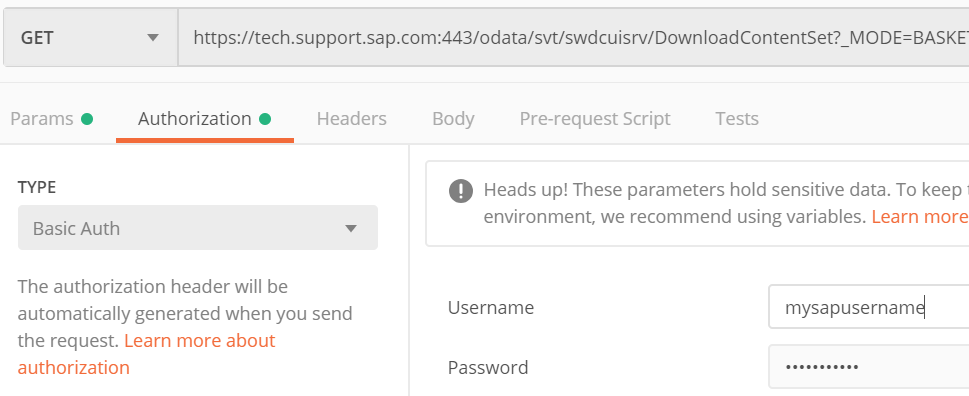
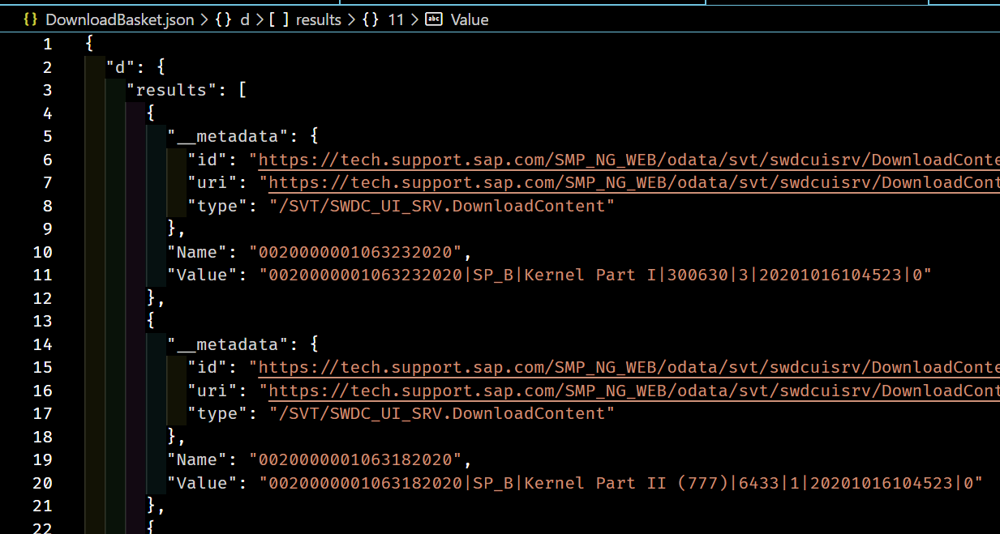

# Application Full BoM Preparation

## Prerequisites

1. A Linux, MAC or Windows based workstation with the [`postman`](https://www.postman.com/downloads/) utility.
1. An editor for working with the SAP Application BoM file.
1. Application installation template(s) for SCS and/or PAS/AAS.
1. SAP Application media present on the Storage Account.
1. You have completed the downloading of associated stack files to your workstation's `stackfiles` folder.
1. An empty folder in which to create the BoM file.

## Inputs

1. Stack files.

## Process

1. Download the associated stack files to your workstation's empty, working folder;
1. Create an empty text file called `bom.yml`.

   ```text
   .
   ├── bom.yml      <-- BoM content will go in here
   ├── MP_Excel_xxx.xls
   ├── MP_Plan_xxx.pdf
   ├── MP_Stack_xxx.txt
   ├── MP_Stack_xxx.xml
   └── myDownloadBasketFiles.txt
   ```

### Get the SAP Download Basket Manifest

Ensure you do this section **before** running SAP Download Manager.

1. Start the `postman` utility and create a new `GET` request by clicking the :heavy_plus_sign: in the workspace tab.

   

1. Ensure `GET` is selected and enter the request URL as `https://tech.support.sap.com:443/odata/svt/swdcuisrv/DownloadContentSet?_MODE=BASKET_CONTENT&_VERSION=3.1.2&$format=json`

   

1. Select the `Authorization` tab and choose `TYPE` as `Basic Auth` and enter your SAP user name and password in the appropriate fields.

   

1. Click the blue `Send` button.

1. Copy the Raw JSON response body and save it in `DownloadBasket.json` in the `stackfiles/` folder on your workstation.

   

1. Within the `S4HANA_2020_ISS_v001` folder, create an empty text file called `bom.yml`.

   ```text
   .
   ├── bom.yml      <-- BoM content will go in here
   ├── DownloadBasket.json
   ├── MP_Excel_xxx.xls
   ├── MP_Plan_xxx.pdf
   ├── MP_Stack_xxx.txt
   ├── MP_Stack_xxx.xml
   └── myDownloadBasketFiles.txt
   ```

### Example Partial BoM File

An example of a small part of a BoM file for S/4HANA 1909 SP2 is shown, below. The `[x]` numbered sections are covered in the following documentation. Note that `v001` is a sequential number used to indicate the internal (non-SAP) version of the files included.

Note that the `name` property is optional in `media`, `stackfiles` and `templates`. If provided, it will be used by the BoM validator to note entries having errors.

Complete, usable BoM files are available in the [examples](../examples/) directory.

```text
step|BoM Content
    |
    |---
    |
[1] |name:    'S4HANA_2020_ISS_v001'
[2] |target:  'ABAP PLATFORM 2020'
    |
[3] |defaults:
    |  target_location: "{{ target_media_location }}/download_basket"
    |
[4] |product_ids:
    |  scs:
    |  db:
    |  pas:
    |  aas:
    |  web:
    |
[5] |materials:
[6] |  dependencies:
    |    - name:     HANA2
    |
[7] |  media:
    |    - name:     SAPCAR
    |      archive:  SAPCAR_1320-80000935.EXE
    |
    |    - name:     SWPM
    |      archive:  SWPM20SP06_6-80003424.SAR
    |
    |    - name:     SAP IGS HELPER
    |      archive:  igshelper_17-10010245.sar
    |
    |    - name:     SAP HR 6.08
    |      archive:  SAP_HR608.SAR
    |
    |    - name:     S4COREOP 104
    |      archive:  S4COREOP104.SAR
    |
[8] |  templates:
    |    - name:     "S4HANA_2020_ISS_v001 ini file"
    |      file:     S4HANA_2020_ISS_v001.inifile.params
    |      override_target_location: "{{ target_media_location }}/config"
    |
[9] |  stackfiles:
    |    - name: Download Basket JSON Manifest
    |      file: downloadbasket.json
    |      override_target_location: "{{ target_media_location }}/config"
    |
    |    - name: Download Basket Spreadsheet
    |      file: MP_Excel_2001017452_20201030_SWC.xls
    |      override_target_location: "{{ target_media_location }}/config"
    |
    |    - name: Download Basket Plan doc
    |      file: MP_Plan_2001017452_20201030_.pdf
    |      override_target_location: "{{ target_media_location }}/config"
    |
    |    - name: Download Basket Stack text
    |      file: MP_Stack_2001017452_20201030_.txt
    |      override_target_location: "{{ target_media_location }}/config"
    |
    |    - name: Download Basket Stack XML
    |      file: MP_Stack_2001017452_20201030_.xml
    |      override_target_location: "{{ target_media_location }}/config"
    |
    |    - name: Download Basket permalinks
    |      file: myDownloadBasketFiles.txt
    |      override_target_location: "{{ target_media_location }}/config"
```

### Manual Process

:hand: The manual process is documented here for reference. Normally, it's recommended to use the [Scripted Process](#scripted-process) to generate the bulk of the BoM, with a few "[Finalize the Content](#finalize-the-content)" activities to complete.

#### Create BoM Header

1. `[1]` and `[2]`: Record appropriate names for the build and target. The `name` must be the same as the BoM folder name in the Storage Account.

#### Create Defaults Section

1. `[3]`: This section contains:
   1. `target_location`: The folder on the target server, into which the files will be copied for installation. Normally, this will reference `{{ target_media_location }}` as shown.

#### Create Product Ids Section

1. `[4]`: Create the section as shown. You will populate with values as part of the template preparation.

#### Create Materials Section

1. `[5]`: Use exactly as shown. This specifies the start of the list of materials needed.

1. `[6]`: You may have dependencies on other BoMs (for example for HANA, as shown here). In order fully define the materials for this build, you should add these dependencies here.

#### Create List of Media

1. `[7]`: Specify `media:` exactly as shown.

1. :hand: The `SAPCAR` utility will need to be added separately, because even though it is in the SAP Download Basket, it will not be present in the spreadsheet.

   ```text
      - name:     SAPCAR
        archive:  SAPCAR_1320-80000935.EXE
   ```

1. Using **your editor**, open the download basket spreadsheet. This will render as XML.
1. Ensure the XML is formatted for human readability.
1. Using your editor, transcribe the description and filename as `- name` and `archive` respectively into your `bom.yml` file. Do this for the *whole file* under a `media` section as indicated in the example.
1. You will need the blue-ringed number in the next section, so record it along with the entry you are making in your `bom.yml`. For example, add the number as a comment.

   

   ```text
   - name: "SAP IGS Fonts and Textures"
     archive: "igshelper_17-10010245.sar"
     # 61489

     ... etc ...
   ```

#### Include SAP Permalink References

1. Open the `DownloadBasket.json` in your editor and reformat to make it more human readable.

   

1. For each of the `"Value":` lines, take the first, second and fourth items from the following vertical-bar separated values. For example:

   ```text
        "Value": "0020000000703122018|SP_B|SAP IGS Fonts and Textures|61489|1|20201023150931|0"
   ```

   Will give you `0020000000703122018`, `SP_B` and `61489`.

   Using the third value (61489 in this example) as a key, match up the results with the values you recorded as comments in the previous phase.

   ```text
   - name: "SAP IGS Fonts and Textures"
     archive: "igshelper_17-10010245.sar"
     # 61489
   ```

1. For each entry matched, add a `sapurl:` value based on the number up to the first vertical bar. Each entry should include the SAP software download URI location. You may delete the comment. For example:

   ```text
   ```text
   - name: "SAP IGS Fonts and Textures"
     archive: "igshelper_17-10010245.sar"
     sapurl: "https://softwaredownloads.sap.com/file/0020000000703122018"
   ```

1. The other part (`SP_B` in the examples shown) has these observed values:

   1. `SP_B`: These appear to be kernel binary files.
   1. `SPAT`: These appear to be non-kernel binary files.
   1. `CD`: These appear to be database exports.

### Scripted Process

The scripted process applies automation to the steps described in the [Manual Process](#manual-process). After running the script you should use your editor to check through the "[Finalize the Content](#finalize-the-content)" steps to ensure the BoM is organized as you want it.

:hand: The script processes the Stack `.xsl` file. Consequently, it will only generate entries for the media files identified by the SAP Maintenance Planner. Any files added to the SAP Download Basket independently (for example by using SAP Launchpad), will need adding into the BoM manually.

After downloading the stack files and Download Basket manifest `.json` file into your workstation's `stackfiles/` folder:

1. Ensure you are in the `stackfiles/` folder:

   ```text
   cd stackfiles
   ```

1. Run the script `generate_bom.sh` from the `util` folder. Note, you will need to replace the example `/path/to/util/` with the correct directory path on your workstation.

   ```text
   /path/to/util/generate_bom.sh >../bom.yml
   ```

   This example makes assumptions about the Storage Account location and the product name. The BoM file `bom.yml` will be written to the parent directory of the `stackfiles/` folder.

1. The script accepts parameters to specify the Storage Account location and the product name. See the [comment block](https://github.com/Azure/sap-hana/blob/5576bd29ea7e25fc8d879093e40e88ae192df656/util/generate_bom.sh#L3-L25) at the start of the script for more information.

### Finalize the Content

#### Add/Check Templates Section

1. `[8]`: If following the Manual Process, create a `templates` section as shown, with the same filename prefix as the BoM `<stack_version>`.

   If following the Scripted Process, you should check the `file` and `override_target_location` values are as expected and correct if necessary.

   ```text
   templates:
     - name:     "S4HANA_2020_ISS_v001 ini file"
       file:     S4HANA_2020_ISS_v001.inifile.params
   ```

#### Add/Check Stackfiles Section

1. `[9]`: If following the Manual Process, create a `stackfiles` section as shown from the steps at the start of **[Process](#process)**.

   If following the Scripted Process, you should check the entries are as expected, and correct if necessary.

   ```text
   stackfiles:
     - name: Download Basket JSON Manifest
        file: downloadbasket.json

     - name: Download Basket Spreadsheet
        file: MP_Excel_2001017452_20201030_SWC.xls
   ```

#### Override Target Location

Files downloaded or shared from the archive space will need to be extracted to the correct location on the target server. This is normally set using the `defaults -> target_location` property (see [the defaults section](#red_circle-create-defaults-section)). However, you may override this on a case-by-case basis as shown. Overrides will normally reference `{{ target_media_location }}` as shown.

1. For each relevant entry in the BoM `media` section, add an `override_target_location:` property with the correct target folder. For example:

   ```text
   - name: Download Basket Stack XML
      file: MP_Stack_2001017452_20201030_.xml
      override_target_location: "{{ target_media_location }}/config"

   - name: Download Basket permalinks
      file: myDownloadBasketFiles.txt
      override_target_location: "{{ target_media_location }}/config"
   ```

#### Override Target Filename

By default, files downloaded or shared from the archive space will be extracted with the same filename as the `archive` filename on the target server.  However, you may override this on a case-by-case basis, although this is not normally necessary.

1. For each relevant entry in the BoM `media` section, add an `override_target_filename:` property with the correct target folder. For example, the following are recommended (the archive name may be different for your system):

   ```text
      - name:     SAPCAR
        archive:  SAPCAR_1320-80000935.EXE
        override_target_filename: SAPCAR.EXE

      - name: "SWPM20SP07"
        archive: "SWPM20SP07_2-80003424.SAR"
        override_target_filename: SWPM.SAR
        sapurl: "https://softwaredownloads.sap.com/file/0020000001812632020"
   ```

#### Tidy Up Layout

1. The script-generated dependency placeholder on the `HANA2` BoM will need editing to match the actual BoM name required.

   ```text
   dependencies:
     - name: "HANA2"
   ```

1. The order of entries in the `media` section does not matter. However, for improved readability, you may wish to group related items together.

### Validate the BoM

1. [Validate the BoM](../bom-validation.md)

### Upload Files to Archive Location

1. From the correct Azure storage account, navigate to "Containers", then to "sapbits";
1. In the panel on the right, click Select a file;
1. Navigate your workstation to your working directory;
1. Select `bom.yml`;
1. Click Advanced to show the advanced options, and enter `boms/<Stack_Version>` for the Upload Directory.

## Results and Outputs

1. A `bom.yml` file present in the Storage Account in the correct location. In this example, `sapbits/boms/S4HANA_2020_ISS_v001/bom.yml`.
