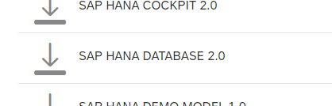
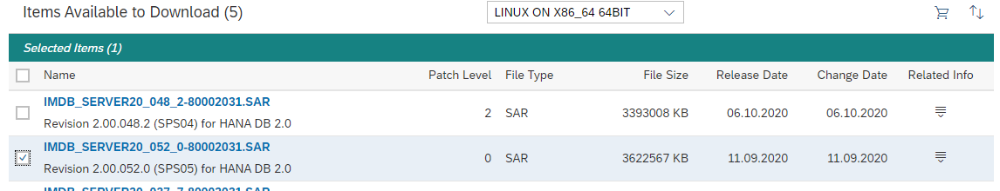
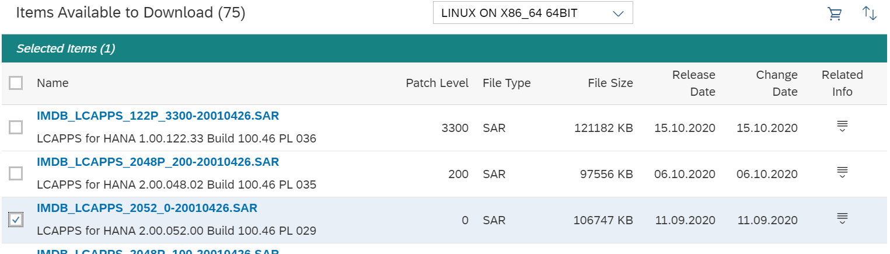

# HANA Media Acquisition

**_Note:_** Creating a Virtual Machine within Azure to use as your workstation will improve the upload speed when transferring the SAP media to a Storage Account.

## Prerequisites

1. User must have an SAP account which has the correct permissions to download software and access Maintenance Planner;
1. User has [SAP Download Manager](https://softwaredownloads.sap.com/file/0030000001316872019) installed on their workstation;
1. User has Java installed to run SAP Download Manager.

## Inputs

1. SAP account login details (username, password);
1. SAP System Product to deploy, e.g. `S/4HANA`;
1. SAP Database configuration;
1. OS intended for use on HANA Infrastructure.

## Process

1. Create unique Stack Download Directory for SAP Downloads on User Workstation, e.g. `~/Downloads/HANA2.0/`.
1. Log in to [SAP Launchpad](https://launchpad.support.sap.com/#).
1. Navigate to Software Downloads to clear the download basket:
   1. Click Download Basket in the bottom right corner;
   1. Select all items;
   1. Click the X above the table to remove any selected items from the Download Basket.
1. Find the SAP HANA Database media (Database and any additional components required) and add to download basket:
   1. Ensure the search type at the top of the screen is set to Downloads;
   1. Enter `HANA PLATFORM` into the search bar and click the search button;
   1. Find the version of SAP HANA you wish to download, e.g. `SAP HANA PLATFORM EDITION 2.0`;
   1. To download the patch files select `Maintenance Product`. Choosing the `Installation Platform` will download the cd realse (.zip), however this process uses the `Maintenance Product` patch file (.SAR);
   1. If prompted, click on the row with `SAP HANA DATABASE 2.0`;

      

   1. Ensure the OS dropdown is `LINUX ON X86_64 BIT`;
   1. Click the checkbox next to the edition you wish to use, e.g. `Revision 2.00.052.0 (SPS05) for HANA DB 2.0`;
   1. Click the Shopping Cart icon above the table to add to the download basket.

      

1. Repeat the process for any additional components required for your database installation, for example the `LCApps` component:
   1. Enter `LCAPPS` into the search bar and click the search button;
   1. Click the `SAP HANA LCAPPS` row with `Maintenance Software Component`;
   1. If there is a dropdown menu above the table to the left of the Shopping Cart icon, ensure it is set to the correct OS type, e.g. `LINUX ON X86_64 64BIT`;
   1. Click the checkbox next to the row which corresponds with your database version, e.g. `IMDB_LCAPPS_2052_0-20010426.SAR` with description `LCAPPS for HANA 2.00.052.00 Build 100.46 PL 029`;
   1. Click the Shopping Cart icon above the table to add to the download basket.

      

1. Repeat the process for the SAPCAR tool required for extracting the SAP HANA Installation Media:
   1. Enter `SAPCAR` into the search bar and click the search button;
   1. Click the `SAPCAR` row with `Maintenance Software Component`;
   1. Click the latest version row, e.g. `SAPCAR 7.21`;
   1. Ensure the OS dropdown menu above the table is set to your target OS, e.g. `LINUX ON X86_64 64BIT`;
   1. Click the checkbox next to the SAPCAR row, e.g. `SAPCAR_1320-80000935.EXE`;
   1. Click the Shopping Cart icon to add to the download basket.

      

1. Navigate to the Download Basket by clicking the link at the bottom of the Software Downloads screen;
1. Check the list of items contains all the downloads required for your SAP HANA Database installation;
1. Click the `T` icon above the table to download a file containing the URL hardlinks for the download basket and save to your workstation 1.
1. From your workstation:
   1. Run SAP Download Manager and login to access your SAP Download Basket;
   1. Set download directory to Stack Download Directory created in Phase 1b, step 1;
   1. Download all files into empty DIR on workstation.

**_Note:_**

1. The text file containing the download URL hardlinks is always named `myDownloadBasketFiles.txt` but is specific to the Application or Database and should be kept with the other downloads for the particular phase so it can be uploaded to the correct location in Phase 2.

## Results and Outputs

1. HANA Database Download Basket URL hardlinks file;
1. HANA Database Installation Media;
1. Stack Download Directory path containing HANA Database Installation Media.
