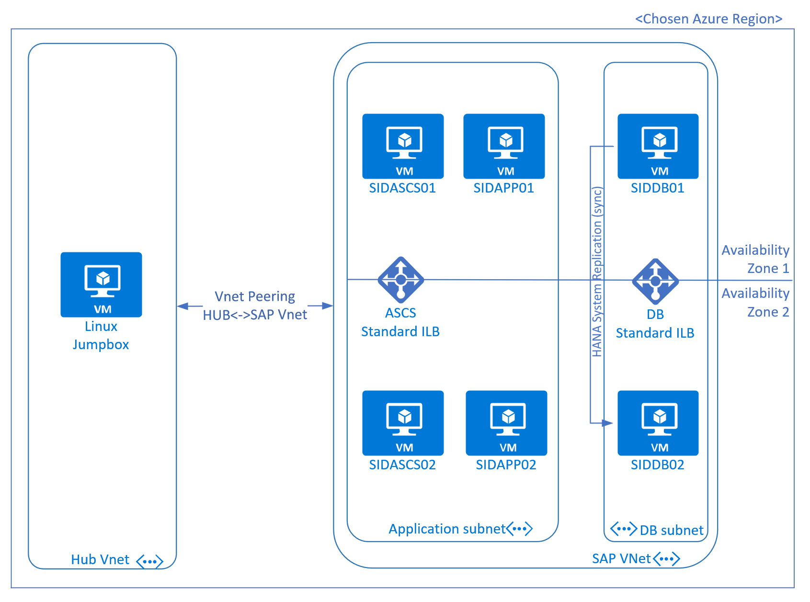

## Deploy SAP systems in Azure - deployment, OS actions and SAP ABAP & HANA install.

### Aim of this project
- a demonstration how Azure CLI and simple Linux bash scripts can easily be utilized to automatically deploy Azure infrastructure for SAP and install all software from scratch - networks, VMs, storage, OS config and SAP/HANA installation in one go
- Azure ARM templates can be complicated beasts which - in this authors opinion - are overused and hard to troubleshoot, AZ CLI on other hand can quickly become second nature particularly for IaaS deployments, without requiring another layer such as Terraform/Ansible (which do have their benefits!)
- Learning exercise coupled with own need for quick-to-spinup demo SAP system with full high availability testing (sans the cluster setup)
- A starting point for own additions and tests

# What this is project IS NOT
- In any way directly affiliated with Microsoft or endorsed by Microsoft. All opinions and statements contained herein are private and not necessarility the opinion of my employer, Microsoft.
- To be used for production deployments.
- Scripts have hardly any error handling, troubleshooting is on you in case things don't work as expected, works as-is.
- While resources in this project are deployed in Availablity Zones, that doesn't mean it's the be-all-end-all for SAP systems in Azure. Far from it, very often going without AvZones is the better choice as they can introduce many other issues you'd not consider before. Consider your needs!
- Not a showcase of coding skills. I'm not a coder/scripter and large parts are not optimal and likely to be improved easily. Any non-condescending advise with example much appreciated :)

## What this project does
If configured correctly it would deploy virtual networks - central hub and SAP spoke - with subnets, NSGs, load balancers.
SAP infrastructure for a single highly available system consisting of 2 ASCS VMs, 2 dedicated applications server VMs and 2 HANA VMs (configurable).
No clustering or active failover mechanism in use, however this can be extended with own actions or scripts, as needed.
Storage design leans on cost-concious setup with Standard_SSDs mostly, yet still using LVM striping on PremSSD for hana data and log.

 - VMs deployed: <sapsid>ascs01/02, <sapsid>app01/02, <sapsid>db01/02
 - VM size - D4s_v3 for SAP application servers, E16s_v3 for the HANA VMs
 - OS + 64GB data disk for SAP app servers, 64 + 5x127GB disks for HANA VMs [following this architecture](https://docs.microsoft.com/en-us/azure/virtual-machines/workloads/sap/hana-vm-operations-storage#cost-conscious-azure-storage-configuration)  
 - SuSE Enterprise Linux 12 SP4 for SAP in latest version
 - Netweaver 7.52
 - SAP HANA 2.0, SPS3 or higher recomended
 
# Prerequisites for use
- Software download and storage account - Azure Storage Account with your chosen name and blob container, using access keys for authentication.
- SAP software can of course only be sourced from SAP, you need to download from SAP and upload to your Azure storage container following files
    - Linux SAPCAR executable (not SAR archive), stored as sapcar_linux
    - Linux SWPM SAR file, latest version, stored as SWPM.SAR
    - Linux SAP ABAP Kernel SAR file, latest version for Netweaver 7.52 on Linux, stored as SAPEXE.SAR
    - Linux SAP ABAP Kernel disp+work SAR file, matching the above kernel, stored as DW.SAR
    - Linux SAP ABAP HANA Kernel SAR file, same version as above kernel, stored as SAPEXEDB.SAR
    - Linux SAP Host Agent for Linux in latest version as SAR file (not rpm), stored as SAPHOSTAGENT.SAR
    - Linux HANA 2.0 DB Server patch, for latest version HANA2, stored as IMDB_SERVER.SAR
    - Linux HANA Client patch, latest version for HANA2, stored as IMDB_CLIENT.SAR
    - SAP Netweaver 7.52 export cds, extracted in flat structure and compressed in single zip, stored as nw752_exp.zip
    - SAP Netweaver 7.52 languages cds, extracted in flat structure and compressed in single zip, stored as nw752_lang.zip
    - SAP IGS executable part for NW7.52 SAR file, stored as IGSEXE.SAR
    - SAP IGS helper part for NW7.52 SAR file, stored as IGSHELPER.SAR
- Availability zones must be enabled for deployment on your Azure subscription, in chosen region. Alternatively edit script 2_create_SAP_infra to remove zonal deployment for VMs.
- Deployment requires upto 12 vCores of Ds_v3 VMs and upto 32 vCores of Es_v3 quota in chosen region. Ensure you have sufficient vcore allocation available.
- Parameters.txt file used for deployment contains details such as storage account housing all files (in your or somebody's else subscription), names and SIDs, master password to use, etc.

# How to deploy
Pull all files off this project to separate folder - e.g. git pull https://github.com/msftrobiro/SAPonAzure/edit/master/temp_sap_systems

Alternatively, just download the 1_create_jumpbox.sh with parameters.txt to your Linux system (Azure cloudshell or Windows Linux Host both work).

Edit parameters.txt and provide the required values, observe the upper/lowercase information (which means ALL characters should be upper/lowercase).

Execute 1_create_jumpbox.txt and typically in 10 minutes you have your Linux jumphost ready to go and continue.

On jumpbox - follow output of the first script - execute the predownloaded 2_... script and your parameters.txt is copied from your previous shell, keeping your values.

### Steps in code
- download all files (to own linux environment or Azure bash shell)
- vim parameters.txt
- ./1_create_jumpbox.sh
- ssh <username>@<jumpbox> #as displayed by first script, all subsequent scripts should be ran on jump server
- screen -m -S sap2 ./2_create_SAP_infra.sh -L -Logfile screen_log_2.log
- screen -m -S sap3 ./3_install_DB_and_App.sh -L -Logfile /tmp/screen_log_3.log
- '<further scripts, coming down the line/own>'

### Naming convention
Basic naming convention utilized for resources, resource type (VM, VNET, LB, VPN etc) as first character name and location shortname (EUN for EuropeNorth, EUW for EuropeWest etc) are typically used, followed by resource name.

### Changelog
v0.2, Oct 28 2019
- added new parameters to control if db02/app02/ascs02 should be installed at all. If all set to false, only 3 VMs for normal 3tier setup will be deployed
- using PPGs for SAP systems, one PPG per zone
- changed NSGs to subnets and not VM NICs directly

v0.3, Nov 11 2019
- added ERS installation but needs to be called interactively!
- added load balancers for DB and ASCS, if configured to deploy 2 of either
- cleaned up this page

upcoming v0.4, planning end of Nov 2019
- add DRBD if 2 ASCS VMs configured
- simple NFS and ASCS failover scripts
- start/stop of VM+app, through simple web interface
- simple backup script for db and logs with version control
- add some sample NSG rules

### Missing features down the line, aka endless ToDo list
- Backup integration (optional script)
- ASR setup, as option (low prio, too many variables and rather complex)
- put more options in scripts, e.g ultraDisk or full prod-sizing with M-series and write accelerator
- some basic error checking - did you provide values correctly, do ssh keys exist, error code checking
- make sapinst less spammy, redirect 
- SSO SAML2 for Web-SAPGui all scripted, incl sap rfc triggered actions in script 
- use azure private dns instead of ugly host file
- change nfs server to Azure Files NFS once released
- db copy support
- ... 

### closing note
Unattended sapinst is terrible, fact
